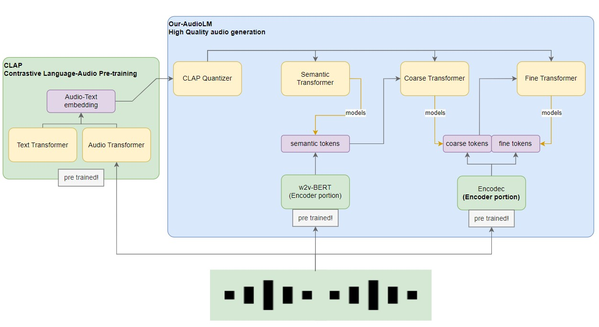

## idl-project: 
# CLAudioLM: Text-Conditioned Music Generation in Waveform Domain

We tackle the task of generating music in the raw audio domain conditioned with
text inputs. For this, we implemented a variant of the MusicLM[1] architecture,
which models the generation of music as an auto-regressive task of hierarchical
discrete tokens. The main updates made to the MusicLM architecture were chang-
ing the music embedding component, called MuLan[5], with CLAP[21]. We
also changed the SoundStream component, a universal neural audio codec, with
EnCodec[29] which has similar performance and is publicly available. Our goal
is to out-perform previous methods by generating a new dataset to fine-tune the
CLAP component using distilled musical knowledge from a large language model
like ChatGPT[30]. We observed that ChatGPT can generate subjectively accurate
and expressive captions for a whole variety of songs, which can be effective in
improving the overall text conditioning for this model.

## Usage
The main portion of the code is in the form of jupyter notebook files in the folder notebooks.

There are other auxiliary scripts on deployment that were used to execute code (datase extraction and some training) on the AWS cloud using IaC.

## Citations
This code uses directly or reuses code from the following repos:

- https://github.com/lucidrains/audiolm-pytorch
- https://github.com/lucidrains/musiclm-pytorch
- https://github.com/LAION-AI/CLAP
